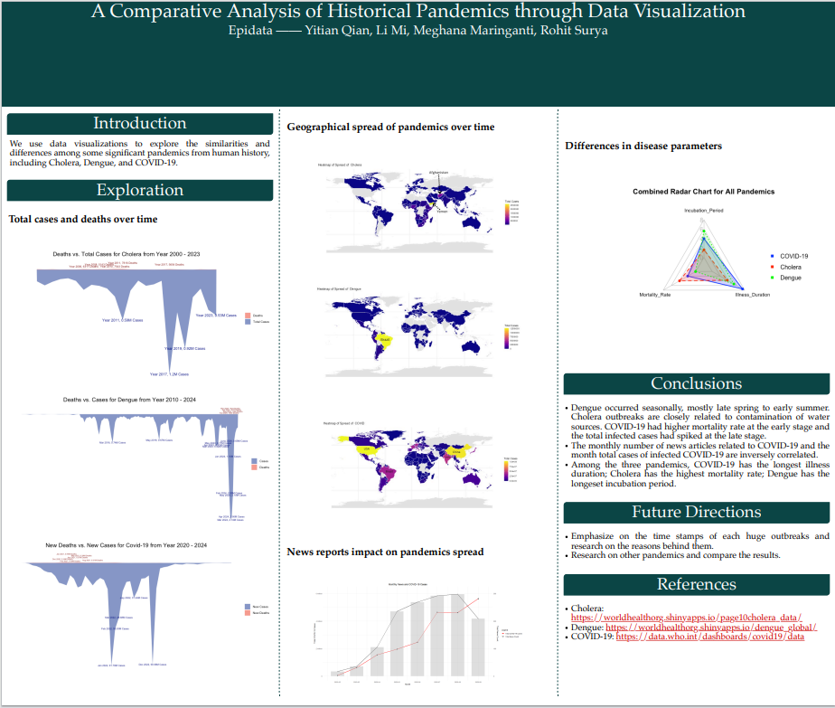

<h1>BRIEF INTRODUCTION</h1>

This project, developed entirely in R, utilizes advanced data visualization techniques to perform an in-depth comparative analysis of three significant pandemics in history: Cholera, Dengue, and COVID-19. The primary datasets were sourced from the World Health Organization (WHO) and underwent extensive data preprocessing and aggregation for robust analysis.

We employed stream graphs to effectively visualize trends over time for total cases and mortality rates for each disease, highlighting key outbreak periods and peaks. These visualizations clearly illustrated distinct seasonal patterns for Dengue outbreaks, significant spikes associated with contaminated water sources for Cholera, and the global spread dynamics of COVID-19.

Interactive geographic heatmaps were created using R's ggplot2 and Shiny frameworks, illustrating the intensity and distribution of the pandemics across different regions and time periods. This approach enabled rapid identification of high-risk areas and provided valuable insights into the effectiveness of public health interventions.

Moreover, leveraging R's web scraping capabilities, we collected data on the frequency of COVID-19 news reports during the early stages of the pandemic. By comparing these news counts with the number of new infection cases using combined line graphs and histograms, our analysis revealed a negative correlation—suggesting that increased media coverage potentially raised public awareness and helped mitigate the spread of the virus.

Finally, radar charts were generated to compare critical epidemiological factors—incubation period, mortality rate, and illness duration—across the three diseases. This method effectively highlighted key differences: Cholera exhibited the highest mortality rate, Dengue had the longest incubation period but the lowest mortality, while COVID-19 showed moderate incubation periods alongside longer illness durations.

  

